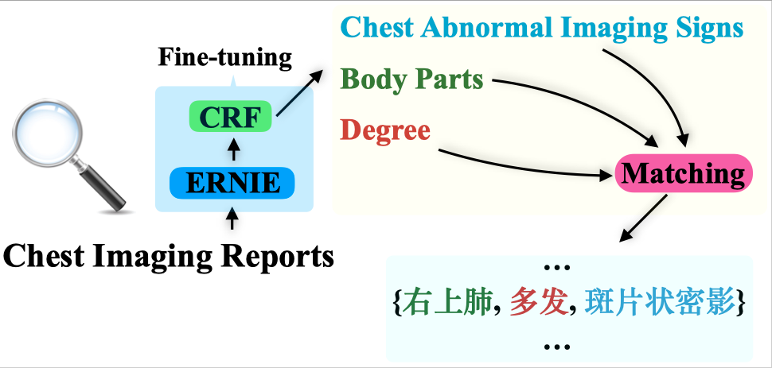

# EASON
Fine-tuning **E**RNIE for Chest **A**bnormal Imaging **S**igns Extracti**ON**
- Zhaoning Li (lizhn7@mail2.sysu.edu.cn), Jiangtao Ren (issrjt@mail.sysu.edu.cn)
- School of Data and Computer Science, Guangdong Province Key Lab of Computational Science, Sun Yat-Sen University, Guangzhou, Guangdong 510006, PR China
- We release the code and terminology to the research community for further research

## Highlights
- Fine-tuning the pretrained language model alleviates the problem of data insufficiency
- A novel tag2relation algorithm has been proposed to serve the matching task
- Experimental results show that the proposed method outperforms other baselines

## Abstract

Chest imaging reports describe the results of chest radiography procedures. Automatic extraction of abnormal imaging signs from chest imaging reports has a pivotal role in clinical research and a wide range of downstream medical tasks. However, there are few studies on information extraction from Chinese chest imaging reports. In this paper, we formulate chest abnormal imaging sign extraction as a sequence tagging and matching problem. On this basis, we propose a transferred abnormal imaging signs extractor with pretrained ERNIE as the backbone, named EASON (fine-tuning ERNIE with CRF for Abnormal Signs ExtractiON), which can address the problem of data insufficiency. In addition, to assign the attributes (the body part and degree) to corresponding abnormal imaging signs from the results of the sequence tagging model, we design a simple but effective tag2relation algorithm based on the nature of chest imaging report text. We evaluate our method on the corpus provided by a medical big data company, and the experimental results demonstrate that our method achieves significant and consistent improvement compared to other baselines.

## Graphical abstract

## Keywords

Chest Abnormal Imaging Signs Extraction, Sequence Tagging, ERNIE, Conditional Random Field

## Download link for the trianing weights

- https://pan.baidu.com/s/1llpxeMg-0f-JQYIZfjACUA  
- password: 5tyy

## Download link for the ERNIE

- https://pan.baidu.com/s/1ioJrtr5Hnh0BRWQRa-R3lQ  
- password: y1ig

## Citation

Coming soon
